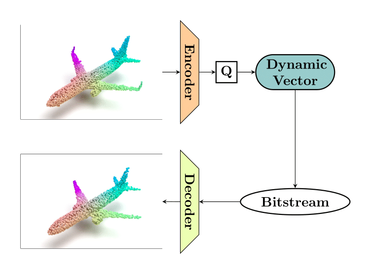

## Variable Rate Compression for Raw 3D Point Clouds

### Overview

3D sensors generate enormous amounts of point cloud data at high frame rates.
For example, a 3D point cloud with 0.7 million points per frame at 30 frames per
second needs a bandwidth of approximately 500 MB/s for video. Working with
uncompressed point cloud data can lead to congestion and delays in communication
networks. Thus, efficient compression coding technologies are indispensable for
ensuring the compact storage and transmission of such data.

<p align="center">

</p>

This repository provides source code for our 2022 ICRA paper titled "[Varible
Rate Compression for Raw 3D Point Cloud
Data](https://arxiv.org/pdf/2202.13862.pdf)." Our model can compress raw point
clouds, at a broad range of bitrates, without converting them into a voxelized
representation. More specifically, there are two prominent benefits of our
approach: (i) there is no loss of information due to voxelization; (ii) the
compression and reconstruction performance is not affected by the underlying
point cloud density. Additionally, our technique reduces the unnecessary
computational burden induced by the processing of unoccupied voxels. 

### Citation

If you find this project useful, then please consider citing our work.

```bibitex
@inproceedings{muzaddid2022variable,
  title={Variable Rate Compression for Raw 3D Point Clouds},
  author={Al Muzaddid, Md Ahmed and Beksi, William J},
  booktitle={Proceedings of the IEEE International Conference on Robotics and Automation (ICRA)},
  pages={8748--8755},
  year={2022}
}
```

### Model Architecture 

<p align="center">

</p>

### Installation

This software was tested using Python 3.6,
[TensorFlow](https://www.tensorflow.org/install) 1.14 and 1.15, and TensorFlow
Compression 1.3. For the encoder, we utilize source code from the PointNet and
PointNet++ GitHub repositories. Please follow the *Compile Customized TF
Operators* section from [PointNet++](https://github.com/charlesq34/pointnet2)
to compile the custom tf_ops. In addition, we make use of the [Fan et
al.](https://github.com/fanhqme/PointSetGeneration) CUDA implementations of the
chamfer and earth mover's distance.

First, install the required Python libraries listed in requirements.txt. Then,

        $ cd src/external

and modify the first three lines of the makefile to point to your nvcc,
cudalib, and tensorflow library. Finally, to compile the code run

        $ make

### Usage

#### Model Training

Before training, please modify the DATA_DIR path in *train.py* to point to your
data directory location. Then, start training 

        $ python train.py 

#### Compression Example

To compress a point cloud using a trained model, first modify the path
variables at the beginning of *compressor_decompressor.py*. Then, run the
following command 

        $ python compressor_decompressor.py compress 

To change the compression rate, the embedding length can be specified as follows

        $ python compressor_decompressor.py compress 884

#### Decompression Example

Likewise, with a modified path to the compressed file location, you can
decompress a point cloud using the following command

        $ python compressor_decompressor.py decompress 

### License 

[](https://github.com/robotic-vision-lab/Variable-Rate-Compression-For-Raw-3D-Point-Clouds/blob/main/LICENSE)
