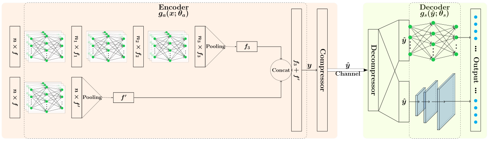

## 3D Point Cloud Compression
 

### Citation
If you find our work useful in your research, please consider citing:

       @article{muzaddid2022variable,
       title={Variable Rate Compression for Raw 3D Point Clouds},
       author={Muzaddid, Md Ahmed Al and Beksi, William J},
       journal={arXiv preprint arXiv:2202.13862},
       year={2022}
}

### Installation

Code is tested with python 3.6, <a href="https://www.tensorflow.org/install/">TensorFlow</a> 
version 1.14, 1.15 and *tensorflow-compression* version 1.3. For encoder part,
we have borrowed the code from *pointnet* and *pointnet++* github codebase.
Follow the *Compile Customized TF Operators* section
from [pointnet++](https://github.com/charlesq34/pointnet2) to compile custom 
tf_ops. Install required python library listed into requirement.txt.
We have used [Fan et. al.](https://github.com/fanhqme/PointSetGeneration)
cuda implementation of chamfer/EMD loss. To compile
```
cd src/external

with your editor modify the first three lines of the makefile to point to 
your nvcc, cudalib and tensorflow library.

make
``` 
### Usage

#### Compression
To compress pointcloud with a trained model, at first modify path 
 variables at the beginning of the *compressor_decompressor.py* file.
 Then run the following command: 

        python compressor_decompressor.py compress 

#### Decompression
Similarly, with modified path reflecting the compressed file location,
 you can decompress the pointcloud using the following command: 

        python compressor_decompressor.py decompress 

####Training
Before training, modify the DATA_DIR path in train.py file according to your
data location. Then, simply run the *train.py* file 

        python train.py 
